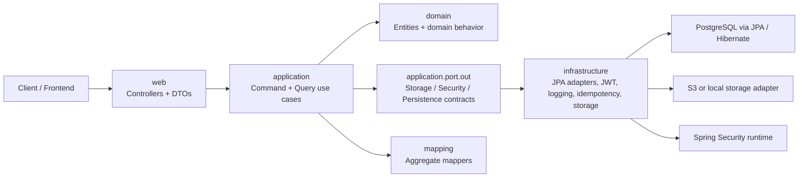
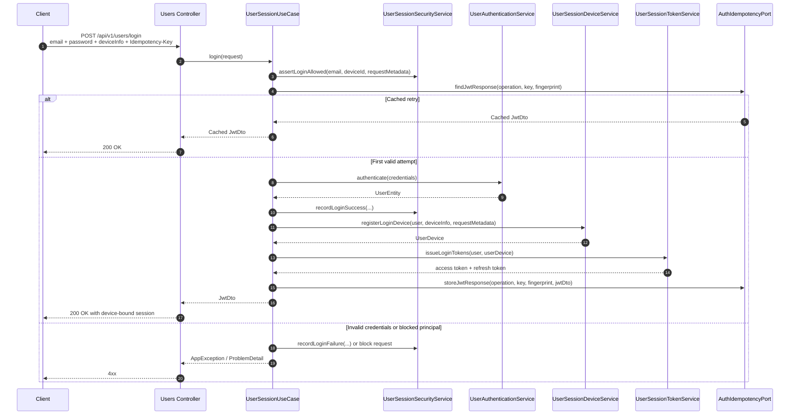
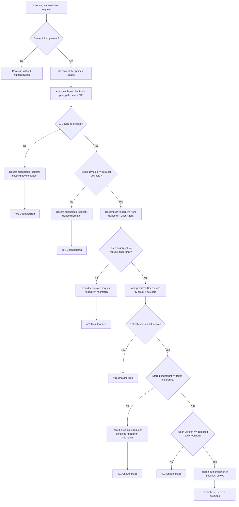
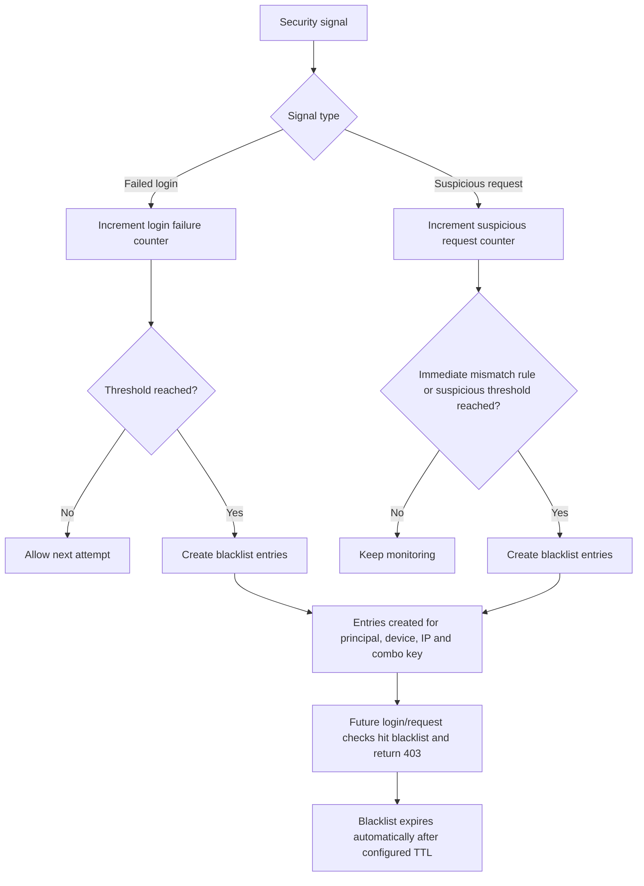

# Backend Funeraria App

Monolithic backend for the operational management of a funeral home. The service centralizes
authentication, affiliates, deceased people, funerals, purchases, inventory, plans, suppliers and
support catalogs behind a single HTTP API.

The project is intentionally evolving as a clean and modern modular monolith:

- Java 25
- Spring Boot 4
- PostgreSQL
- Flyway for versioned database migrations
- Spring Security with device-bound JWT sessions
- Spring Boot Actuator and Prometheus metrics
- MapStruct for aggregate mappers
- Apache Commons for focused utility usage
- JUnit 5, Mockito, Testcontainers and JaCoCo for the automated test suite

## What This Service Does

This backend covers the main business workflows of the funeral operation:

- user registration, activation, login, logout and refresh
- user profile management, addresses, mobile numbers and roles
- affiliate management
- deceased management
- funeral creation and update
- income registration, stock updates and plan price refresh
- item, plan and supplier administration
- lookup catalogs used by forms and business rules

In practice, this is the system of record for the core administrative flows of the funeral home.

## Architectural Style

The codebase follows a clean-architecture-inspired modular monolith. The goal is not to split the
system into microservices, but to keep business rules isolated from technical details so the
monolith remains maintainable as it grows.

### Package layout

- `web`
  - HTTP controllers
  - request and response DTOs
  - transport-only concerns
- `application`
  - `usecase` classes for business orchestration, split into command and query
  - `port.out` contracts for persistence, storage, security and infrastructure concerns
  - `support` services for reusable application logic
- `domain`
  - entities and domain behavior
- `infrastructure`
  - adapters for JPA, storage, request metadata, idempotency, security integrations and logging
- `mapping`
  - one mapper per aggregate, grouping entity <-> DTO conversions in a single place

### Conventions to keep when adding new code

When a new feature is added, follow the same conventions already used in the repository:

1. Put HTTP-specific concerns in `web`.
2. Keep orchestration in `application/usecase`, split into command/query when it improves clarity.
3. Put business state transitions in `domain` entities when they belong to the aggregate.
4. If the use case depends on persistence, storage or framework-specific behavior, depend on a
   port from `application/port/out`, not on the concrete adapter.
5. Implement the technical detail in `infrastructure`.
6. Use the aggregate mapper already associated with that slice instead of creating mapper classes
   per request type.
7. Keep exceptions keyed by `messages_es.properties`; do not hardcode user-facing messages.
8. Prefer structured logs with key-values in important flows.
9. Update tests and `openapi.yaml` in the same change set.

### What this means in practice

- The monolith stays monolithic.
- The business layer does not know if storage is S3, local disk or another provider.
- The business layer does not know if persistence is backed by PostgreSQL today and another SQL
  database tomorrow.
- New code should fit the existing boundaries instead of bypassing them.

## Architecture Guardrails

The repository now includes automated architectural guardrails using ArchUnit. These rules run as
part of the test suite, so `mvn test` and `mvn verify` fail when a change breaks agreed package
boundaries.

Current checks focus on preventing regressions such as:

- `domain` depending on `application`, `web`, `infrastructure` or repository implementations
- `application` use cases and services depending directly on repositories or infrastructure adapters
- controllers bypassing the application layer to access persistence
- direct `EntityManager` or `SecurityContextHolder` usage inside `web` or `application`
- outbound ports turning into concrete classes
- mappers depending on repositories or infrastructure

The guardrail test lives in:

- [`src/test/java/disenodesistemas/backendfunerariaapp/modern/architecture/ArchitectureGuardrailsTest.java`](src/test/java/disenodesistemas/backendfunerariaapp/modern/architecture/ArchitectureGuardrailsTest.java)

## Architecture Overview

The following diagram shows the intended dependency direction inside the monolith. Controllers
translate HTTP traffic, use cases orchestrate business flows, entities keep domain state and
infrastructure provides adapters for technical concerns.



## Security Model

Authentication is stricter than a plain JWT setup. The service currently uses:

- Argon2 for password hashing
- application-level peppering
- access tokens with device claims
- opaque rotating refresh tokens
- device fingerprint validation
- `X-Device-Id` enforcement on authenticated endpoints
- adaptive blocking and blacklist behavior for suspicious requests
- `Idempotency-Key` support for login and refresh
- request tracing with `X-Trace-Id` and optional `X-Correlation-Id`

Important headers:

- `Authorization: Bearer <token>`
- `X-Device-Id: <device-id>`
- `Idempotency-Key: <unique-key>` for login and refresh
- `X-Correlation-Id: <client-correlation-id>` optional

### Runtime Secrets Validation

`RuntimeSecretsValidator` runs during the Spring lifecycle and inspects the three runtime
secrets used by authentication: `jwt-token.secret`, `security.password.pepper` and
`security.request.fingerprint-secret`.

- In Spring profiles `prod` or `production`, any blank value, the documented development
  placeholder, or a value shorter than 16 characters aborts the boot with a structured error
  log so misconfigured deployments fail fast instead of serving traffic with predictable
  secrets.
- In every other profile (including the default profile, `dev`, `test` and `docker`), the
  same findings are surfaced as a structured warning under the event
  `security.secrets.weak`. The application keeps running so local development remains
  frictionless, but contributors still see the signal in their logs.

The placeholder catalogue lives in the validator and mirrors the defaults declared in
`application.yaml`. Whenever a default changes, the corresponding constant in
`RuntimeSecretsValidator` must be updated together with the property file.

## Observability

The service includes a production-oriented observability baseline:

- structured logs with `traceId` and `correlationId`
- optional JSON logs through the `json-logs` Spring profile
- Actuator endpoints
- Prometheus metrics exposure
- request tracing through `X-Trace-Id` and optional `X-Correlation-Id`
- distributed tracing via Micrometer Tracing bridged to the OpenTelemetry SDK; spans ship over
  OTLP/HTTP when `MANAGEMENT_OTLP_TRACING_ENDPOINT` is set
- optional local Prometheus, Grafana, Alertmanager, OpenTelemetry Collector and Tempo stack
  through Docker Compose

Default public operational endpoints:

- `GET /actuator/health`
- `GET /actuator/health/liveness`
- `GET /actuator/health/readiness`
- `GET /actuator/info`
- `GET /actuator/prometheus`

If you want JSON logs locally:

```bash
mvn spring-boot:run -Dspring-boot.run.profiles=json-logs
```

Docker already starts the app with `docker,json-logs`.

If you want the full local observability stack:

```bash
docker compose --profile observability up --build
```

Useful local URLs when the profile is enabled:

- Prometheus: `http://localhost:9090`
- Alertmanager: `http://localhost:9093`
- Grafana: `http://localhost:3000`
- OTel Collector OTLP/HTTP: `http://localhost:4318`
- OTel Collector OTLP/gRPC: `http://localhost:4317`
- Tempo HTTP: `http://localhost:3200`

Provisioned dashboards:

- `Backend Funeraria Overview`
- `Backend Funeraria Auth Overview`

Provisioned datasources:

- `Prometheus` (default)
- `Tempo` — search traces by `traceId`, jump from a trace to logs and view the service map

To ship spans from the application to the local stack, set
`MANAGEMENT_OTLP_TRACING_ENDPOINT=http://otel-collector:4318/v1/traces` (in your shell or
`.env`) before running the observability profile. Without that variable the application still
produces spans in process and the `traceId` continues to flow into MDC and response headers,
but nothing is exported.

Baseline alert rules:

- application down
- high 5xx ratio
- high latency p95
- high JVM heap pressure
- high Hikari connection pool pressure

Alertmanager routes every firing alert (with a `RESOLVED` companion email when it clears) to a
single email receiver over Gmail SMTP. Credentials and the recipient address are injected as
environment variables and substituted into `alertmanager.yml` at startup, so no secret is
committed to the repository.

To switch from the dummy defaults to a real Gmail account:

1. Enable 2FA on the sending Gmail account and generate a Google App Password
   (https://support.google.com/accounts/answer/185833).
2. Set in `.env` (or your shell):

   ```bash
   ALERTMANAGER_SMTP_USER=<your-gmail-account>
   ALERTMANAGER_SMTP_PASSWORD=<the-app-password>
   ALERTMANAGER_SMTP_FROM=<your-gmail-account>
   ALERTMANAGER_EMAIL_TO=<recipient-address>
   ```

3. Restart the observability profile: `docker compose --profile observability up --build`.

Until those values are real, the alertmanager service still starts and the UI works, but SMTP
sends fail at auth or connection level and the messages are dropped. ADR-0008 documents the
decision and the trade-offs in detail.

## Security Flows

These diagrams explain the runtime behavior expected by the current security implementation.

### Authentication and token issuance

This is the login flow. It combines idempotency, adaptive threat checks, device registration and
token issuance.



### Authorization and stolen token detection

This is the request validation flow once the client already has a bearer token. The goal is to
detect a token that was copied from one device and replayed from another context.



### Blacklist and suspicious behavior escalation

This flow explains how repeated failures or device anomalies become short-lived blacklist entries.



## API Contract

The OpenAPI contract is versioned inside the repository and should be treated as part of the
service source of truth.

Useful files:

- [`src/main/resources/openapi/openapi.yaml`](src/main/resources/openapi/openapi.yaml)
- [`src/main/resources/openapi/README.md`](src/main/resources/openapi/README.md)
- [`docs/api-contract-governance.md`](docs/api-contract-governance.md)

What it documents:

- real endpoints exposed by the current controllers
- request and response DTOs
- security headers and device requirements
- common business and validation errors
- standard `ProblemDetail` error shape

Recommended workflow:

1. update controller / DTO / use case
2. update `openapi.yaml` in the same PR
3. keep examples aligned with the current runtime behavior
4. keep the OpenAPI contract validation test green

You can open the spec directly in Swagger Editor, Redocly or any OpenAPI-compatible client.

## Agent And Contributor Context

The repository includes dedicated context files for humans and coding agents:

- [`AGENTS.md`](AGENTS.md)
- [`MEMORY_BANK.md`](MEMORY_BANK.md)
- [`docs/api-contract-governance.md`](docs/api-contract-governance.md)

These files describe the architectural constraints, security expectations, coding conventions,
testing rules and documentation rules that new changes should follow. If you use an external coding
agent, point it to these files first before asking it to modify the codebase.

## Running Locally With Docker

The fastest way to start the project locally is with Docker Compose.

### Prerequisites

- Docker
- Docker Compose

### Step 1: create a local env file

Use the provided template:

```bash
cp .env.example .env
```

If you are on PowerShell:

```powershell
Copy-Item .env.example .env
```

You can start with the defaults and change values only if needed.

### Step 2: start the stack

```bash
docker compose up --build
```

This starts:

- PostgreSQL
- the Spring Boot app with profile `docker`
- local file storage instead of S3
- Flyway migrations on startup before JPA validation

If you also want Prometheus, Grafana and Alertmanager:

```bash
docker compose --profile observability up --build
```

### Step 3: access the service

Default local URLs:

- API base URL: `http://localhost:8081`
- local file base URL: `http://localhost:8081/files/`

Additional URLs with the `observability` profile:

- Prometheus: `http://localhost:9090`
- Alertmanager: `http://localhost:9093`
- Grafana: `http://localhost:3000`

Default development credentials created automatically in Docker profile:

- email: `admin@funeraria.local`
- password: `Admin123!`

### Notes about local bootstrapping

- Flyway migrations under `src/main/resources/db/migration` create the schema and load reference data
- the Docker profile also bootstraps a development admin user if it does not exist yet
- storage is local in Docker, so no AWS setup is required to start developing
- `.env.example` documents the runtime variables expected by Docker Compose; keep it in sync when
  adding configuration knobs

### Useful Docker commands

Start in detached mode:

```bash
docker compose up -d --build
```

Stop the stack:

```bash
docker compose down
```

Stop and remove volumes:

```bash
docker compose down -v
```

## Running Locally Without Docker

If you prefer running directly on your machine:

### Prerequisites

- JDK 25
- Maven 3.9+
- PostgreSQL

### Minimal setup

Set environment variables or rely on the defaults from `application.properties`:

- `SPRING_DATASOURCE_URL`
- `SPRING_DATASOURCE_USERNAME`
- `SPRING_DATASOURCE_PASSWORD`
- `JWT_TOKEN_SECRET`
- `SECURITY_PASSWORD_PEPPER`
- `SECURITY_REQUEST_FINGERPRINT_SECRET`
- `APP_STORAGE_PROVIDER`

### Start the app

```bash
mvn spring-boot:run
```

By default the application listens on `http://localhost:8081`.

### Database migrations

Schema evolution is managed with Flyway.

Useful location:

- [`src/main/resources/db/migration`](src/main/resources/db/migration)

Important rule:

- do not change an already applied migration in a shared branch
- add a new versioned migration instead

## Tests, Integration And Coverage

The repository uses a modern test suite based on JUnit 5, Mockito and Testcontainers. Coverage is
enforced in the build with JaCoCo, and architecture boundaries are enforced with ArchUnit.

Useful commands:

```bash
mvn test
```

```bash
mvn verify
```

What `mvn verify` does:

- runs the active modern test suite
- runs integration tests against real PostgreSQL containers
- enforces the architectural guardrails
- enforces lightweight static analysis with Checkstyle
- generates the JaCoCo report
- fails the build if line coverage drops below `85%`

Generated coverage report:

- `target/site/jacoco/index.html`

## Continuous Integration

GitHub Actions now covers quality, image validation and repository hygiene through separate
workflows:

- `CI`
  - Maven `verify`
  - unit and integration tests
  - Flyway + Testcontainers validation
  - OpenAPI contract validation
  - Checkstyle, JaCoCo and Surefire artifact upload
  - Docker image build validation with Buildx cache
  - container smoke test using the Docker healthcheck
- `Dependency Review`
  - pull-request diff inspection for risky dependency changes
- `CodeQL`
  - static security analysis for the Java codebase on PRs, protected branches and a weekly schedule
- `Container Release`
  - manual or tag-based Docker image publication to GitHub Container Registry
  - container smoke test before publishing
  - image SBOM generation through Syft
  - Trivy image vulnerability scanning before publishing
- Dependabot
  - weekly dependency updates for Maven and GitHub Actions

Workflow files:

- [`.github/workflows/ci.yml`](.github/workflows/ci.yml)
- [`.github/workflows/dependency-review.yml`](.github/workflows/dependency-review.yml)
- [`.github/workflows/codeql.yml`](.github/workflows/codeql.yml)
- [`.github/workflows/container-release.yml`](.github/workflows/container-release.yml)
- [`.github/dependabot.yml`](.github/dependabot.yml)

Container images are published to:

- `ghcr.io/andinogabriel/backend-funeraria-app`

Release tags:

- `sha-<commit>` is always published
- `v*` Git tags publish the matching version tag and `latest`
- manual runs from `master` can publish an optional custom tag and optionally `latest`

The runtime image defines a Docker `HEALTHCHECK` against `/actuator/health/liveness`. CI and
container releases both start PostgreSQL, apply the Flyway migrations, start the built image and
wait for that healthcheck before considering the image usable.

CI also runs a source ignore guard before Maven. This protects runtime-critical source folders
from broad `.gitignore` patterns, such as accidentally ignoring every nested `storage` package.

Recommended repository settings for the default branch:

- require `CI`, `Dependency Review` and `CodeQL` before merge
- enable squash merge as the default strategy
- enable auto-merge only after required checks pass

## Architecture Decision Records

Important architectural decisions are documented as ADRs in:

- [`docs/adr`](docs/adr)

Current ADRs cover:

- modular monolith boundaries
- device-bound authentication
- Flyway + Testcontainers
- observability and build-time quality gates
- local Prometheus, Grafana and Alertmanager before OpenTelemetry
- Caffeine in-process caching for catalog lookups
- distributed tracing via Micrometer Tracing bridged to the OpenTelemetry SDK
- Alertmanager email delivery via Gmail SMTP, configured through env vars
- virtual threads end-to-end (Tomcat HTTP connector + `@Async`), reversible via the
  `SPRING_THREADS_VIRTUAL_ENABLED` env var

Repository collaboration defaults also live in:

- [`.github/CODEOWNERS`](.github/CODEOWNERS)
- [`.github/pull_request_template.md`](.github/pull_request_template.md)
- [`.github/ISSUE_TEMPLATE`](.github/ISSUE_TEMPLATE)

## Useful Entry Points For New Developers

If you are taking over the repository, these files are good starting points:

- [`README.md`](README.md)
- [`AGENTS.md`](AGENTS.md)
- [`MEMORY_BANK.md`](MEMORY_BANK.md)
- [`docs/adr`](docs/adr)
- [`config/observability`](config/observability)
- [`src/main/resources/openapi/openapi.yaml`](src/main/resources/openapi/openapi.yaml)
- [`src/main/resources/application.yaml`](src/main/resources/application.yaml)
- [`docker-compose.yml`](docker-compose.yml)
- [`src/main/java/disenodesistemas/backendfunerariaapp/application/usecase`](src/main/java/disenodesistemas/backendfunerariaapp/application/usecase)
- [`src/main/java/disenodesistemas/backendfunerariaapp/infrastructure`](src/main/java/disenodesistemas/backendfunerariaapp/infrastructure)

## Related Frontend

- [frontend-funeraria-app](https://github.com/andinogabriel/frontend-funeraria-app)
